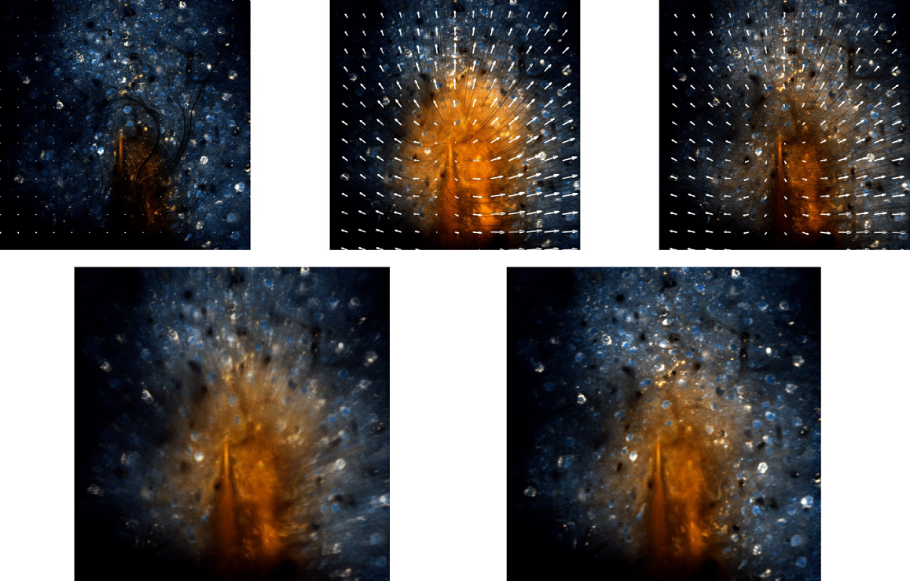

# ImageJ / FIJI plugin for Optical flow based motion compensation for 2-photon imaging data

The preprint of our paper can later be found on [bioRxiv](https://www.biorxiv.org/) and the project website [here](http://www.snnu.uni-saarland.de/flow_registration/).




## Download

Download the repository via
```
$ git clone https://github.com/phflot/flow_registration_IJ.git
```

## Documentation and Usage

This code consists of a python class to extract the circular calibration pattern in all cameras on synchronized 
recordings downsampled to 10hz and stores the results in an hdf5 file. The precomputed centers can then be used for
multicamera calibration which is based on opencv's calibration functions. We use the calibration in the paper to project points from the stereo RGB cameras and from the Kinect into the thermal image.  

## Citation

Details on the method and video results can be found [here](http://www.snnu.uni-saarland.de/flow_registration/).

If you use parts of this code or the plugin for your work, please cite
  
> P. Flotho, S. Nomura, B. Kuhn, D. J. Strauss, “Software for non-parametric Image Registration of 2-Photon Imaging Data” [bioRxiv](), 2021. 

BibTeX entry
```
@article{flotea2021b,
    author = {Flotho, P. and Nomura, S. and Kuhn, B. and Strauss, D. J.},
    title = {Software for non-parametric Image Registration of 2-Photon Imaging Data},
	year = {2021},
	journal = {bioRxiv}
}
```